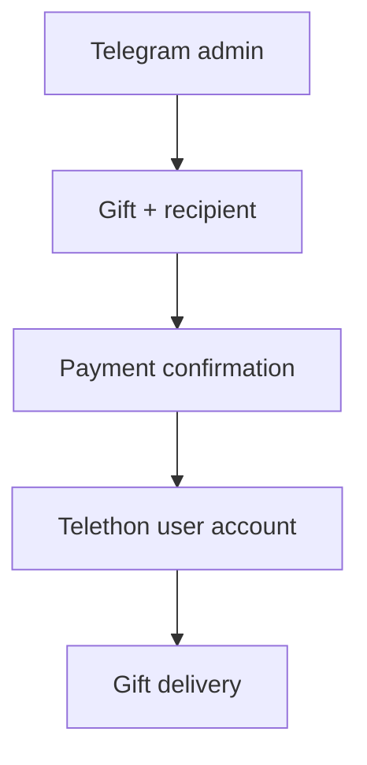

# Telegram Gift Sender

[Русский](README.md) · [English](README_EN.md)

Приватная Telegram-панель для выбора и отправки подарков с пользовательского аккаунта. Перед оплатой показывает получателя, цену, текст и настройки анонимности. Stars списываются с баланса авторизованного аккаунта.

## Требования

- Python 3.14 или новее;
- Windows для готовых `.bat`-launcher'ов;
- пользовательский Telegram-аккаунт с достаточным количеством Stars;
- `api_id` и `api_hash` из [Telegram API development tools](https://my.telegram.org);
- Telegram bot token от [@BotFather](https://t.me/BotFather);
- числовой Telegram ID каждого администратора.

## Быстрый старт

### 1. Клонируйте репозиторий

```powershell
git clone https://github.com/soroka01/gift-sender-telegram.git
cd gift-sender-telegram
```

### 2. Создайте конфигурацию

```powershell
Copy-Item config.example.py config.py
```

Откройте `config.py` и замените примеры своими значениями.

### 3. Авторизуйте пользовательский аккаунт

```bat
login.bat
```

Telethon запросит номер телефона, код из официального чата **Telegram** и пароль 2FA, если он включён. После успешного входа рядом со скриптом появится `user_account.session`.

### 4. Запустите панель

```bat
start.bat
```

Launcher создаёт локальную `.venv` и устанавливает зависимости из `requirements.txt`. Затем отправьте управляющему боту:

```text
/gift @username
```

Если `config.py` отсутствует, `start.bat` или `login.bat` создаст его из примера и остановится, чтобы credentials не вводились в неправильный файл.

### Ручной запуск

Windows PowerShell:

```powershell
python -m venv .venv
.\.venv\Scripts\python.exe -m pip install -r requirements.txt
Copy-Item config.example.py config.py
.\.venv\Scripts\python.exe login.py
.\.venv\Scripts\python.exe main.py
```

На Linux и macOS можно использовать те же Python-файлы без `.bat`-launcher'ов:

```bash
python3 -m venv .venv
source .venv/bin/activate
python -m pip install -r requirements.txt
cp config.example.py config.py
python login.py
python main.py
```

## Как это работает



## Настройки

```python
BOT_TOKEN = "PUT_TELEGRAM_BOT_TOKEN_HERE"

API_ID = 0
API_HASH = "PUT_TELEGRAM_API_HASH_HERE"
USER_SESSION = "user_account"

ADMIN_IDS = {123456789}

DEFAULT_HIDE_NAME = True
DEFAULT_INCLUDE_UPGRADE = False
GIFT_MESSAGE = ""
```

| Поле | Назначение |
| --- | --- |
| `BOT_TOKEN` | Token управляющего бота от BotFather |
| `API_ID` | ID Telegram API application |
| `API_HASH` | Hash Telegram API application |
| `USER_SESSION` | Имя Telethon session без расширения `.session` |
| `ADMIN_IDS` | Множество Telegram ID с доступом к панели |
| `DEFAULT_HIDE_NAME` | Начальное состояние анонимной отправки |
| `DEFAULT_INCLUDE_UPGRADE` | Разрешать ли получателю улучшение по умолчанию |
| `GIFT_MESSAGE` | Необязательный обычный текст по умолчанию |

`GIFT_MESSAGE` из конфигурации не содержит Telegram entities. Чтобы прикрепить кастомные Premium Emoji, введите сообщение через интерфейс бота.

## Сценарий отправки

1. Отправьте `/gift @username`.
2. Выберите подарок. У снятых мишек вместо остатка указана дата выхода.
3. Проверьте цену и переключите анонимность или разрешение улучшения.
4. При необходимости добавьте текст и Premium Emoji.
5. Нажмите «Отправить» только после проверки итоговых параметров.

Один экран последовательно меняется между вводом текста, подтверждением, отправкой и подробным итогом. Stars списываются только после последней кнопки.

## Снятые безлимитные подарки

Встроенный список содержит сезонных и временных мишек, выпущенных с 31 декабря 2025 года по 13 августа 2026 года. Они отсутствуют в текущем `GetStarGifts`, поэтому хранятся по техническому ID и дате первого появления.

Перед каждой отправкой сервер Telegram дополнительно проверяет ID. Если Telegram отключит конкретный подарок, панель покажет отказ до запроса платёжной формы.

### Свои обозначения мишек

Отредактируйте публичный файл [`gift_descriptions.json`](gift_descriptions.json). Мишки расположены от нового к старому и подписаны точным временем выхода по Екатеринбургу (`UTC+5`), поэтому ориентироваться по ID не требуется. В `name` задаётся короткое обозначение подарка, а в `description` — необязательное подробное описание:

```json
{
  "released_at": "13.08.2026 00:37",
  "name": "Мишка с бомбой",
  "gift_id": "6046178578163303744",
  "description": "в тёмных очках и с красным шарфом"
}
```

`name` появляется на кнопке выбора и используется как название подарка. Непустой `description` дополнительно показывается на экране ввода текста, подтверждении и в финальном чеке. Каждое поле ограничено 120 символами; пробельные символы автоматически нормализуются. Файл перечитывается при каждом `/gift`, поэтому перезапуск после редактирования не нужен.

| Gift ID | Дата выхода | Встроенное название |
| --- | --- | --- |
| `5956217000635139069` | 31.12.2025 | Новогодний мишка |
| `5800655655995968830` | 14.02.2026 | Мишка на 14 февраля |
| `5866352046986232958` | 08.03.2026 | Мишка на 8 марта |
| `5893356958802511476` | 17.03.2026 | Мишка на День святого Патрика |
| `5935895822435615975` | 01.04.2026 | Мишка на 1 апреля |
| `5969796561943660080` | 12.04.2026 | Мишка |
| `6026193266406327981` | 01.05.2026 | Мишка |
| `5974210632977745012` | 20.07.2026 | Мишка-футболист |
| `6046178578163303744` | 13.08.2026 | Мишка |

Поля `released_at` и `gift_id` менять не нужно. JSON специально отделён от секретного `config.py`, поэтому заполненные названия и описания можно безопасно публиковать в репозитории для всех пользователей.

## Логи

Технический журнал записывается в `gift_sender.log` рядом с `main.py` и одновременно выводится в консоль.

| Параметр | Значение |
| --- | --- |
| Максимальный размер | 5 МБ |
| Архивы | `gift_sender.log.1` — `gift_sender.log.3` |
| Кодировка | UTF-8 |
| События | каталог, выбор, параметры, отправка, результат, ошибки и длительность |

Лог содержит Telegram ID администратора, username получателя и gift ID. Текст подарка, bot token, API hash, session key и платёжная ссылка в него не записываются.

## Безопасность и приватность

- Никогда не коммитьте `config.py`, `*.session`, `*.session-journal`, `.venv` и `*.log`.
- Telethon session даёт доступ к пользовательскому аккаунту и требует защиты на уровне пароля.
- Не запускайте несколько процессов с одним session-файлом: SQLite вернёт `database is locked`.
- Не оставляйте `ADMIN_IDS` пустым и не добавляйте туда незнакомые ID.
- Проверяйте username, цену и анонимность перед подтверждением.
- После утечки bot token или API credentials немедленно отзовите их.
- Используйте проект только для собственного аккаунта и с соблюдением правил Telegram.

## Ограничения

- Telegram может в любой момент отключить отправку снятого подарка.
- Список снятых мишек обновляется вручную при появлении новых ID.
- Возможность улучшения зависит от данных конкретного подарка и Telegram API.
- Payment verification может потребовать отдельного перехода по ссылке; скрипт не повторяет списание автоматически.
- Полноценный end-to-end тест требует реального аккаунта, Stars и получателя.

## Лицензия

[MIT](LICENSE).

## Поддержка

Можно [форкнуть репозиторий](https://github.com/soroka01/gift-sender-telegram/fork) и доработать под себя. Если проект пригодился, поставьте [Star](https://github.com/soroka01/gift-sender-telegram) — так я увижу, что он был кому-то полезен.

---

with love ❤️
