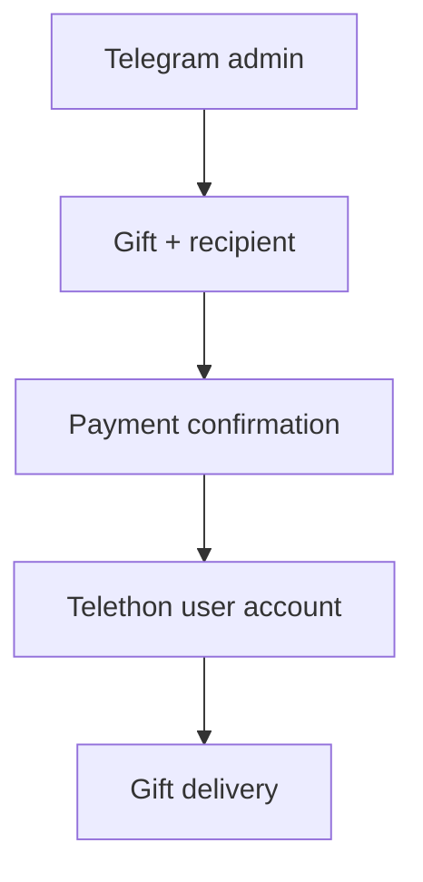

# Telegram Gift Sender

[Русский](README.md) · [English](README_EN.md)

Private Telegram panel for selecting and sending gifts from a user account. Shows the recipient, price, message, and anonymity settings before payment. Stars are charged to the signed-in user account.

## Requirements

- Python 3.14 or newer;
- Windows for the included `.bat` launchers;
- a Telegram user account with enough Stars;
- an `api_id` and `api_hash` from [Telegram API development tools](https://my.telegram.org);
- a Telegram bot token from [@BotFather](https://t.me/BotFather);
- the numeric Telegram ID of every administrator.

## Quick start

### 1. Clone the repository

```powershell
git clone https://github.com/soroka01/gift-sender-telegram.git
cd gift-sender-telegram
```

### 2. Create the configuration

```powershell
Copy-Item config.example.py config.py
```

Open `config.py` and replace every placeholder with your own values.

### 3. Authorize the user account

```bat
login.bat
```

Telethon asks for the phone number, the code from the official **Telegram** chat, and the 2FA password when enabled. A `user_account.session` file appears next to the script after successful authorization.

### 4. Start the panel

```bat
start.bat
```

The launcher creates a local `.venv` and installs `requirements.txt`. Then send this command to the control bot:

```text
/gift @username
```

If `config.py` is missing, `start.bat` or `login.bat` creates it from the example and stops so credentials are never entered into the wrong file.

### Manual startup

Windows PowerShell:

```powershell
python -m venv .venv
.\.venv\Scripts\python.exe -m pip install -r requirements.txt
Copy-Item config.example.py config.py
.\.venv\Scripts\python.exe login.py
.\.venv\Scripts\python.exe main.py
```

Linux and macOS can run the Python files directly without the `.bat` launchers:

```bash
python3 -m venv .venv
source .venv/bin/activate
python -m pip install -r requirements.txt
cp config.example.py config.py
python login.py
python main.py
```

## How it works



## Configuration

```python
BOT_TOKEN = "PUT_TELEGRAM_BOT_TOKEN_HERE"

API_ID = 0
API_HASH = "PUT_TELEGRAM_API_HASH_HERE"
USER_SESSION = "user_account"

ADMIN_IDS = {123456789}

DEFAULT_HIDE_NAME = True
DEFAULT_INCLUDE_UPGRADE = False
GIFT_MESSAGE = ""
```

| Field | Purpose |
| --- | --- |
| `BOT_TOKEN` | Control bot token from BotFather |
| `API_ID` | Telegram API application ID |
| `API_HASH` | Telegram API application hash |
| `USER_SESSION` | Telethon session name without `.session` |
| `ADMIN_IDS` | Telegram user IDs allowed to use the panel |
| `DEFAULT_HIDE_NAME` | Initial anonymous-sending state |
| `DEFAULT_INCLUDE_UPGRADE` | Whether recipient upgrades are allowed by default |
| `GIFT_MESSAGE` | Optional default plain-text message |

`GIFT_MESSAGE` has no Telegram entities. Enter the message through the bot interface when custom Premium Emoji are required.

## Sending Flow

1. Send `/gift @username`.
2. Select a gift. Removed bears show a release date instead of remaining supply.
3. Review the price and toggle anonymity or upgrade permission.
4. Add an optional message and Premium Emoji.
5. Press Send only after reviewing the final parameters.

One message is edited through the text input, confirmation, sending, and detailed result states. Stars are charged only after the last button press.

## Removed Unlimited Gifts

The built-in catalog contains seasonal and temporary bear gifts released between December 31, 2025 and August 13, 2026. They are absent from the current `GetStarGifts` response, so their technical IDs and first-seen dates are stored locally.

Telegram validates each ID again before payment. If a gift becomes disabled, the panel reports the refusal before requesting a payment form.

### Custom Bear Labels

Edit the public [`gift_descriptions.json`](gift_descriptions.json) file. Bears are ordered from newest to oldest and labeled with their exact Yekaterinburg release time (`UTC+5`), so there is no need to identify them by ID. Use `name` for a short gift label and the optional `description` field for additional visual details:

```json
{
  "released_at": "13.08.2026 00:37",
  "name": "Bear with a bomb",
  "gift_id": "6046178578163303744",
  "description": "wearing dark glasses and a red scarf"
}
```

`name` appears on the selection button and becomes the displayed gift name. A non-empty `description` is additionally shown on the text-input screen, confirmation, and final receipt. Each field is limited to 120 characters and whitespace is normalized. The file is reloaded on every `/gift`, so no restart is required after editing it.

| Gift ID | Release date | Built-in name |
| --- | --- | --- |
| `5956217000635139069` | 2025-12-31 | New Year bear |
| `5800655655995968830` | 2026-02-14 | Valentine's Day bear |
| `5866352046986232958` | 2026-03-08 | International Women's Day bear |
| `5893356958802511476` | 2026-03-17 | Saint Patrick's Day bear |
| `5935895822435615975` | 2026-04-01 | April Fools' Day bear |
| `5969796561943660080` | 2026-04-12 | Bear |
| `6026193266406327981` | 2026-05-01 | Bear |
| `5974210632977745012` | 2026-07-20 | Football bear |
| `6046178578163303744` | 2026-08-13 | Bear |

The `released_at` and `gift_id` fields should not be changed. This JSON file is deliberately separate from the secret `config.py`, so completed names and descriptions can be safely published for every user.

## Logs

The technical log is written to `gift_sender.log` next to `main.py` and printed to the console at the same time.

| Setting | Value |
| --- | --- |
| Maximum size | 5 MB |
| Archives | `gift_sender.log.1` through `gift_sender.log.3` |
| Encoding | UTF-8 |
| Events | catalog, selection, options, send attempt, result, errors, and duration |

The log contains the administrator Telegram ID, recipient username, and gift ID. It never stores gift message contents, bot tokens, API hashes, session keys, or payment verification URLs.

## Security and Privacy

- Never commit `config.py`, `*.session`, `*.session-journal`, `.venv`, or `*.log`.
- A Telethon session grants access to the user account and must be protected like a password.
- Do not run multiple processes with the same session file; SQLite will report `database is locked`.
- Never leave `ADMIN_IDS` empty or add unknown IDs.
- Verify the username, price, and anonymity setting before confirmation.
- Revoke bot tokens or API credentials immediately after a leak.
- Use the project only with your own account and in accordance with Telegram's rules.

## Limitations

- Telegram can disable a removed gift at any time.
- Removed bear IDs are updated manually when new gifts appear.
- Upgrade availability depends on the gift and the current Telegram API response.
- Payment verification may require opening a separate URL; the script never retries a charge automatically.
- A complete end-to-end test requires a real account, Stars, and a recipient.

## License

[MIT](LICENSE).

## Support

Feel free to [fork this repository](https://github.com/soroka01/gift-sender-telegram/fork) and adapt it. If it helped you, leave a [Star](https://github.com/soroka01/gift-sender-telegram) so I can see it was useful.

---

with love ❤️
